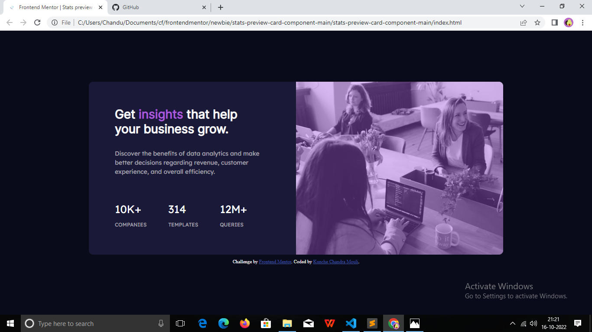

# Frontend Mentor - Stats preview card component solution

This is a solution to the https://www.frontendmentor.io/challenges/stats-preview-card-component-8JqbgoU62. Frontend Mentor challenges help you improve your coding skills by building realistic projects. 

## Table of contents

- overview
  - the-challenge
  - screenshot
  - links
- my-process
  - built-with
  - what-i-learned
- author

## Overview

### The challenge

Users should be able to:

- View the optimal layout depending on their device's screen size

### Screenshot

### Links

- Solution URL: https://github.com/chanduKunche/stats-preview-card-component
- Live Site URL: https://chandukunche.github.io/stats-preview-card-component/

## My process

### Built with

- Semantic HTML5 markup
- CSS custom properties
- Flexbox
- CSS Grid
- Mobile-first workflow

### What I learned

- Learnt how to use CSS flex and grid properties
- Learnt HTML page layout
- Learnt how to design responsive webpage
- Learnt how to design interactive elements

## Author

- Frontend Mentor - https://www.frontendmentor.io/profile/chanduKunche

